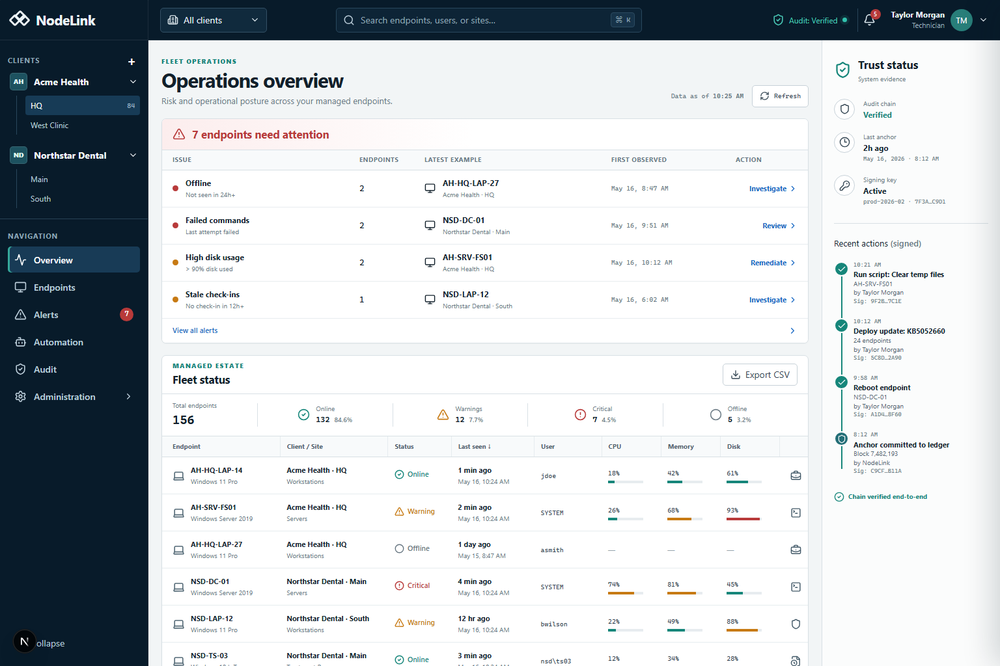
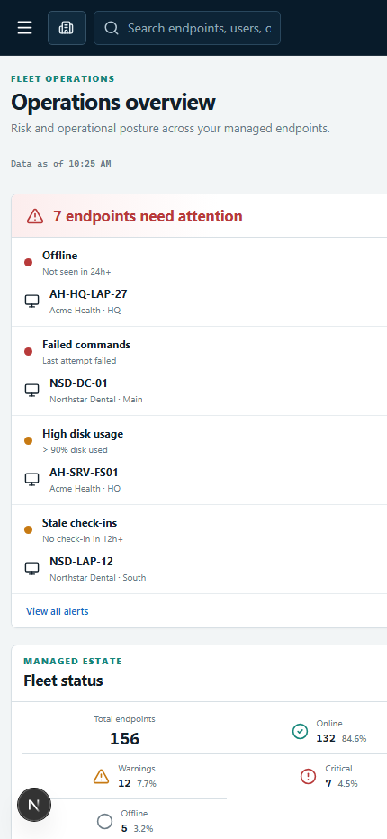

# NodeLink RMM

NodeLink is a self-hosted endpoint-management platform for regulated small
businesses and MSPs. It provides signed remote actions, outbound-only
connectivity, and independently verifiable administrative audit records without
the operational complexity of traditional RMM platforms.

NodeLink is an early-stage, Windows-first project. It is not ready for production or regulated endpoints, and does not claim
HIPAA compliance. The near-term goal is a controlled non-production pilot with
HIPAA-supporting controls and defensible compliance evidence.

## Product direction

NodeLink intends to compete through simpler deployment, policy-controlled and
signed endpoint actions, verifiable audit evidence, and a focused experience for
regulated SMBs and MSPs. General RMM breadth comes later. See the
[competitive strategy](docs/COMPETITIVE-STRATEGY.md) and the
[phased roadmap](docs/ROADMAP.md).

## Current implementation

The code in this repository currently provides:

- A Go agent that runs as a Windows service, connects outbound, and polls the
  FastAPI server through heartbeat responses.
- One-time or limited-use enrollment tokens and long-lived per-agent bearer
  credentials. Server-side token values are stored as SHA-256 hashes.
- Ed25519 signatures over the negotiated `command-v3` envelope: envelope
  version, schema version, command ID, agent ID, kind, payload, issued-at,
  expiry, and nonce. Python and Go consume the same canonical vectors; agents
  reject missing, unknown, malformed, expired, replayed, and downgraded
  envelopes. Key IDs support active/overlap/retired registry states; v2 remains
  available only for mixed-version rollout. Staged key rotation, compromise
  response, and rollback are operator-run via `scripts/rotate_command_key.py`
  (`docs/KEY-ROTATION.md`).
- Basic CPU, memory, system-disk, uptime, and logged-in-user telemetry.
- Buffered PowerShell or shell execution with a five-minute timeout and
  bounded output capture (256 KiB per stream, 384 KiB combined, truncation
  recorded in command and audit data). Results are uploaded only after
  execution finishes.
- Fail-closed production startup validation (`ENVIRONMENT=production` rejects
  debug mode, placeholder secrets, missing signing keys, and non-HTTPS public
  URLs) with explicit opt-in proxy trust for client IPs.
- Operator password authentication, JWT sessions, three global roles, token
  generation revocation, and in-process login throttling.
- Client and site records, agent listing, command dispatch/history APIs, and an
  offline-status sweeper.
- Agent quarantine/restore (operator) and terminal revocation (admin) with
  mandatory reasons and audit events: revoked tokens fail authentication and
  outstanding work is expired; quarantined agents get bare heartbeat acks only.
- DPAPI-protected agent identity on Windows (versioned envelope, restricted
  file ACL, atomic plaintext migration, no plaintext fallback).
- A hash-chained audit log with serialized, hash-bound monotonic sequence
  numbers, plus APIs that create and verify local Merkle
  anchors, plus a scheduled publisher that writes anchor roots to external
  immutable storage (S3 Object Lock or a WORM filesystem) with receipts and
  clean-room verification (opt-in; `docs/AUDIT-ANCHORING.md`).
- An Alembic baseline and forward migration, with exact revision enforcement
  on non-debug startup and a disposable PostgreSQL migration test in CI.
- An Inno Setup Windows installer and tagged release workflow that publishes
  checksums, an SPDX SBOM, and signed build-provenance attestations. Windows
  binaries and the installer are not yet Authenticode-signed.
- Linux and macOS development builds of the polling agent. Windows is the only
  primary support target; those builds are not a supported cross-platform RMM.
- An authenticated Next.js dashboard foundation with a responsive operations
  overview, environment-validated server-only API boundary, same-origin
  operator sessions, and live read-only client, site, endpoint-list, and
  endpoint-detail telemetry views. Aggregate overview and audit panels remain
  fixture-backed, and the dashboard performs no endpoint mutations.

The [architecture document](docs/ARCHITECTURE.md) is the source of truth for
the implementation and its security boundaries.

## Dashboard preview

The technician dashboard combines an authenticated live read-only endpoint
inventory and telemetry detail flow with fixture-backed aggregate operations
and audit panels. The screenshots illustrate the current visual direction; they
are not production or compliance evidence.





## In progress

Milestone 0, Deployment Safety, is nearly complete. Remaining items are an
Authenticode code signing (needs a paid certificate) and running the multi-day
soak test (the harness and runbook ship in `deploy/soak/` and
`docs/SOAK-TEST.md`) before a controlled non-production pilot.

## Planned

- **Milestone 1 — Windows RMM MVP:** authenticated Next.js dashboard, complete
  Windows inventory, monitoring and alerts, notification delivery, script
  library, and recurring tasks.
- **Milestone 2 — Patch and Remediation:** Windows Update policies and
  installation, software deployment, endpoint operations, interactive shell,
  streaming output, MeshCentral integration, and agent self-update.
- **Milestone 3 — Compliance Productization:** evidence bundles, approval
  workflows, tenant-scoped authorization, stronger identity controls,
  immutable retention, audit verification tools, and a customer audit portal.
- **Milestone 4 — Scale and Ecosystem:** shared infrastructure, distributed
  execution, high availability, public APIs, integrations, signed extensions,
  and later Linux/macOS support.

## Explicitly not implemented yet

The repository does **not** currently contain:

- A complete endpoint command console, live audit UI, or production-ready
  dashboard. The current authenticated dashboard is read-only and only its
  client/site navigation, endpoint inventory, and endpoint telemetry detail use
  live API data.
- WebSocket or other live agent transport, interactive remote shell, or
  streaming command output. Polling remains the only transport.
- Complete hardware, software, Windows Defender, BitLocker, Secure Boot, TPM,
  or local-administrator inventory.
- Monitoring policy/check/alert models, alert acknowledgement, email, or
  webhook notifications.
- Script library, scheduled tasks, patch management, remediation operations,
  file transfer, or remote desktop.
- Certificate pinning or a least-privilege agent service account.
- Scheduled production backup evidence (encrypted backup/restore tooling ships
  in `deploy/backup/`), or Authenticode signing (checksums, an SPDX SBOM, and
  signed build provenance are published; only certificate-based signing is
  missing). External audit-anchor publication ships (`docs/AUDIT-ANCHORING.md`)
  but the operator must configure and operate the destination.
- Tenant-scoped authorization, tenant-specific roles or retention, MFA,
  WebAuthn, OIDC/SAML, legal hold, or compliance evidence exports.

## Architecture at a glance

```text
Operator/API client -- JWT --> FastAPI server --> PostgreSQL
                              ^
                              |
Windows agent -- outbound HTTPS heartbeat/poll --+
                signed commands returned in heartbeat response
```

The application does not terminate TLS. The documented deployment topology
places Caddy in front of uvicorn and binds uvicorn to localhost. This is a
deployment procedure today, not an application-level production enforcement
mechanism. See [deployment readiness](docs/DEPLOYMENT-READINESS.md) and the
[TLS runbook](docs/DEPLOYMENT-TLS.md).

## Repository layout

```text
rmm-agent/
├── agent/       # Go endpoint agent and Windows service integration
├── server/      # FastAPI API and persistence layer
├── installer/   # Inno Setup Windows installer
├── deploy/      # Current reverse-proxy example
├── contracts/   # Versioned schemas and shared Go/Python canonical vectors
├── docs/        # Architecture, security, roadmap, and operations documents
└── .github/     # CI, release automation, and contribution templates
```

The `dashboard/` directory contains the authenticated technician interface with
live read-only endpoint inventory and telemetry detail alongside fixture-backed
aggregate operations panels; `tools/` remains planned.

## Local development

See [server/README.md](server/README.md) to run the backend,
[agent/README.md](agent/README.md) to build and enroll an agent, and
[installer/README.md](installer/README.md) for the Windows installer. See
[dashboard/README.md](dashboard/README.md) to run the dashboard foundation.

Before any pilot, review the [threat model](docs/threat-model.md),
[security roadmap](docs/SECURITY-ROADMAP.md), and
[deployment-readiness checklist](docs/DEPLOYMENT-READINESS.md).

## Contributing

Development work is organized through phased GitHub milestones and actionable
issues. Security-sensitive changes require tests, and architecture/security
documentation must be updated in the same pull request as behavior changes.
See [CONTRIBUTING.md](docs/CONTRIBUTING.md).

## License

NodeLink RMM Community Edition is licensed under the GNU Affero General
Public License v3.0 only. See [LICENSE](LICENSE).

SPDX-License-Identifier: AGPL-3.0-only

Commercial licensing may be offered separately for organizations that need
to embed, redistribute, modify, or operate NodeLink under terms other than
the AGPL.

The NodeLink name, logos, product identity, and branding are not licensed
under the AGPL. See [TRADEMARKS.md](TRADEMARKS.md).
