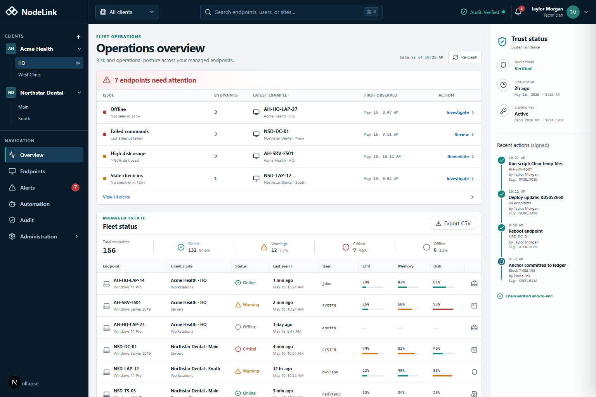
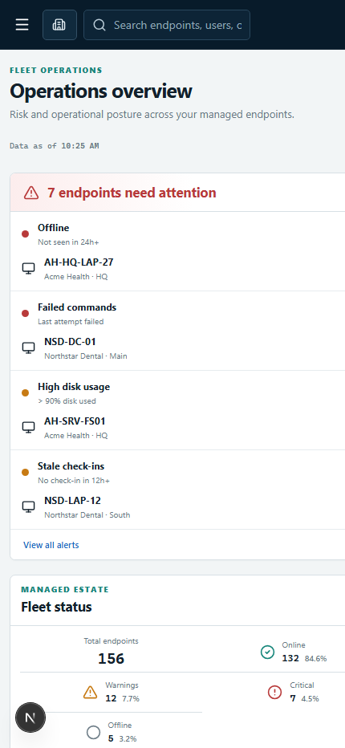

# NodeLink RMM

NodeLink is a self-hosted endpoint-management platform for regulated small
businesses and MSPs. It provides signed remote actions, outbound-only
connectivity, and independently verifiable administrative audit records without
the operational complexity of traditional RMM platforms.

NodeLink is an early-stage, Windows-first project. It is not ready for production or regulated endpoints, and does not claim
HIPAA compliance. The near-term goal is a controlled non-production pilot with
HIPAA-supporting controls and defensible compliance evidence.

## Project status

| Area | Current state |
| --- | --- |
| Latest tagged release | `v0.1.7` (server schema `0035`) |
| Schema on `main` | Alembic revision `0037` (`0036` MeshCentral, `0037` tenant-scoped authorization) |
| Primary support target | Windows agent and Windows service |
| Server | FastAPI management and agent APIs with PostgreSQL; SQLite is limited to development and tests |
| Dashboard | Authenticated Next.js interface backed entirely by live API data: operations overview, endpoints, inventory, command console, interactive shell, alerts, monitoring policies, maintenance windows, scheduled tasks, script library, patch policies and compliance, enrollment, audit evidence, and operator administration. No panel is fixture-backed |
| Deployment | Self-hosted Caddy topology and a Render Docker Blueprint for a stateless backend using external PostgreSQL |
| Current milestone | Milestone 0 and Milestone 1 delivered; most of Milestone 2 implemented; Milestone 3 started (tenant-scoped authorization and evidence bundles/packages) |
| Pilot blockers | Authenticode signing and a recorded multi-day soak run on the intended pilot topology |
| Production status | Not approved for production or regulated endpoints |

The source of truth for completion claims is the
[architecture document](docs/ARCHITECTURE.md). Pilot gates are tracked in the
[deployment-readiness checklist](docs/DEPLOYMENT-READINESS.md), and future
product scope is tracked in the [phased roadmap](docs/ROADMAP.md).

## Product direction

NodeLink intends to compete through simpler deployment, policy-controlled and
signed endpoint actions, verifiable audit evidence, and a focused experience for
regulated SMBs and MSPs. General RMM breadth comes later. See the
[competitive strategy](docs/COMPETITIVE-STRATEGY.md) and the
[phased roadmap](docs/ROADMAP.md).

## Current implementation

The code in this repository currently provides:

- A Go agent that runs as a Windows service, connects outbound, and polls the
  FastAPI server through heartbeat responses.
- One-time or limited-use enrollment tokens and long-lived per-agent bearer
  credentials. Server-side token values are stored as SHA-256 hashes.
- Ed25519 signatures over the negotiated `command-v3` envelope: envelope
  version, schema version, command ID, agent ID, kind, payload, issued-at,
  expiry, and nonce. Python and Go consume the same canonical vectors; agents
  reject missing, unknown, malformed, expired, replayed, and downgraded
  envelopes. Key IDs support active/overlap/retired registry states; v2 remains
  available only for mixed-version rollout. Staged key rotation, compromise
  response, and rollback are operator-run via `scripts/rotate_command_key.py`
  (`docs/KEY-ROTATION.md`).
- Basic CPU, memory, system-disk, uptime, and logged-in-user telemetry.
- Windows hardware inventory: manufacturer/model/serial/BIOS, CPU, memory
  totals and modules, disks and volumes, and network adapters. Each section is
  collected under its own timeout and carries a status, so a failed CIM query
  degrades one section to `unavailable` instead of voiding the snapshot — an
  absent field is never reported as an empty one. The agent advertises a
  per-section hash on each heartbeat and uploads only what the server asks for,
  so an unchanged endpoint transfers no inventory bytes. Submissions are atomic
  and bounded: an oversized or malformed section is rejected rather than
  truncated. Defender, BitLocker, Secure Boot, TPM, and local Administrators
  membership are each collected as their own sections, described below.
- Windows installed-software inventory from the uninstall registry across the
  native 64-bit, `WOW6432Node`, and per-user views, deduplicated across them
  and sorted deterministically so an unchanged machine keeps a stable content
  hash. Install dates are reported only when they parse cleanly. This section
  is bounded by encoded bytes rather than row count, so a machine with unusually
  long program names reports a `partial` list instead of being rejected and
  reporting nothing.
- Read-only Windows Defender status: provider state, real-time and tamper
  protection, engine/signature versions, signature age, and scan times. Posture
  is a separate field from collection status, so a machine running a
  third-party antivirus with Defender stood down is reported as configured
  rather than as unprotected — Defender reports itself disabled while passive,
  and treating that as an alarm would bury the genuinely unprotected endpoints.
  Signature age is computed on the endpoint so a wrong clock still yields a
  correct age. Nothing in this path changes configuration.
- Read-only BitLocker, Secure Boot, and TPM state as three independent
  sections, so one permission failure cannot void the others. **No BitLocker
  recovery key is ever collected** — the query names its properties explicitly
  so key material is never read, and the schema has no field able to hold it.
  Section status distinguishes `permission_denied` from `unavailable`, because
  an empty volume list recorded as healthy would read as "nothing is
  encrypted". Secure Boot on legacy BIOS is reported unsupported rather than
  disabled, and an absent TPM is a successful reading, not a failure.
- Read-only local Administrators membership: the built-in group is resolved by
  its well-known SID (`S-1-5-32-544`) rather than the localized name, and each
  member is classified by identity type (local, domain, or Entra ID) and
  principal class. An unreachable directory is reported `unavailable` and a
  non-Windows host `unsupported`, so an empty membership is never mistaken for
  "no administrators". Membership is never expanded beyond the group itself — a
  nested group is one `group` member, not its transitive users.
- On-demand Windows Update scan and installation (issue #51) via typed
  `scan_updates` and `install_updates` commands. The normalized
  `windows_updates` inventory contains applicable updates plus successful Windows
  Update Agent installation history, including Update IDs for drivers, firmware,
  and definition updates that have no KB. Scans and history failures are reported
  as failed commands rather than clean empty results. Installation is fail-closed:
  an operator must select validated KB/Update IDs or explicitly choose all
  applicable non-hidden updates. These operations run on the command path, not the
  heartbeat, so a minutes-long Windows Update operation never stalls check-in.
- Inventory history and deterministic diffs, with per-endpoint dashboard views.
  Snapshots are written only when a section's content changes, so history is a
  change log rather than a sample. Diffs are identity-keyed rather than
  positional: uninstalling one program reports one removal instead of rewriting
  the whole list. Retention is bounded per section and never prunes the newest
  snapshot, so an endpoint always keeps its current reported state. A section
  that could not be read renders distinctly from one that was read and found
  empty.
- Versioned monitoring-policy identities at global, client, site, and agent
  scopes, with bounded typed check definitions, most-specific-wins resolution,
  scoped maintenance-window records, and an append-only check-result contract
  retained newest-N per endpoint/check key. Operator APIs provide role-gated,
  audited policy/window management plus effective-policy and result reads; the
  dashboard provides a read-only policy list, current check set, and revision
  history. Active agents now execute cadence- and hysteresis-bounded CPU,
  memory, disk, service, and pending-reboot checks with a durable idempotent
  result outbox; the server evaluates offline checks from heartbeat age and
  validates revision-pinned result ingestion. Deterministic alert state,
  maintenance suppression, technician lifecycle actions, durable email, and
  signed generic-webhook notification paths are implemented with live delivery
  history. See `docs/MONITORING.md`, `docs/ALERT-NOTIFICATIONS.md`, and
  `docs/SIGNED-WEBHOOKS.md`.
- Buffered PowerShell or shell execution with a five-minute timeout and
  bounded output capture (256 KiB per stream, 384 KiB combined, truncation
  recorded in command and audit data). Completed results are DPAPI-protected
  in a durable agent outbox before upload and retried idempotently across
  outages, lost acknowledgements, and restarts. Windows commands run in
  kill-on-close Job Objects so timeout, service stop, agent exit, and normal
  shell completion terminate the complete process tree.
- Default-deny arbitrary-script authorization: PowerShell and shell require an
  explicit admin-granted global, site, or agent scope even for admins, while
  typed inventory remains role-authorized. Grant changes and every allow/deny
  decision are audited without recording script contents.
- Administrator-only controlled Windows remediation: capability-gated,
  signed file upload/download inside fixed managed roots plus typed
  HKLM/HKCU read/write/delete inside `Software\\NodeLink\\Managed`, with
  digest/size checks, reparse/device/traversal denial, atomic file replacement,
  compare-and-set registry changes, endpoint-local rollback journals, and live
  dashboard controls. See `docs/CONTROLLED-REMEDIATION.md`.
- Administrator-only audited Windows restart/shutdown with exact-hostname UI
  confirmation, mandatory reason and delay, active-maintenance-window and
  user-session policy, offline expiry, Windows cancellation, capability-gated
  mixed-version rollout, and durable intent/result evidence. See
  `docs/POWER-OPERATIONS.md`.
- Administrator-only bounded Windows event log access: capability-gated,
  metadata-only queries (never message text or EventData) against an allowlisted
  channel with a standard and an elevated tier, mandatory time-window and
  event-count bounds, optional provider/level/event-ID filters, cursor
  pagination, and audited query scope. See `docs/EVENT-LOG-ACCESS.md`.
- Server-side patch approval, installation, and reboot policies: scoped
  (global/client/site/agent, most-specific-wins), versioned approve/deny/defer
  rules on classification, severity, or KB with a default action; the gate
  narrows `install_all` to the approved subset and fails closed on denied
  selections, with optional timezone/DST-aware recurring maintenance windows. A
  policy can also carry a capability-gated post-install reboot policy
  (never/if_required/forced, consent-aware) and a retry bound; the agent tracks
  per-update results and reboots after installing, deferring while a user is
  present. Scheduled installs pass through the same gate. Opt-in and audited. See
  `docs/PATCH-APPROVAL.md`.
- Read-only patch compliance reporting by client, site, and endpoint, with
  compliant/non-compliant/stale/unknown/exempt states, current-policy history,
  bounded CSV/JSON exports, and audit evidence. No migration or agent change.
  See `docs/PATCH-COMPLIANCE.md`.
- Package management via a provider interface (issue #55): typed `scan_packages`
  (read-only, operator-level discovery into the `installed_packages` inventory
  section) and administrator-only `install_packages` (install/upgrade of a
  bounded package-id set). Winget is the always-on default; Chocolatey is opt-in
  per endpoint (advertised only when enabled in config) and additionally requires
  signed source/digest/signer evidence. Capability-gated (`package-management-v1`,
  `chocolatey-provider-v1`), audited, and fail-closed. No schema change. Dashboard
  UI is deferred. See `docs/PACKAGE-MANAGEMENT.md`.
- Administrator-only MSI/EXE software deployment (issue #56): typed
  `deploy_software` downloads an installer from an operator-supplied HTTPS source,
  verifies a mandatory SHA-256 (and an optional pinned Authenticode signer), runs
  it under a bounded argument policy and timeout, maps the exit code
  (`1641`/`3010` as success-with-reboot), applies the post-install reboot policy,
  and records the MSI `ProductCode` as rollback metadata. Integrity is fail-closed
  and the download is bounded and always cleaned up. Capability-gated
  (`software-deployment-v1`), audited (source URL stored only as a digest), and no
  schema change. Dashboard UI is deferred. See `docs/SOFTWARE-DEPLOYMENT.md`.
- Administrator-only Windows service and process management (issue #57): typed
  `list_services`, `control_service` (start/stop/restart), `list_processes`, and
  `terminate_process` commands. Guarded by protected-target denylists, mandatory
  confirmation and reason, capability-gated (`service-process-v1`), audited, and
  fail-closed. No schema change. Dashboard UI is deferred. See `docs/SERVICE-PROCESS-MANAGEMENT.md`.
- Administrator-only signed, staged agent self-update and rollback (issue #63):
  an administrator publishes a release whose metadata (version, channel,
  platform, artifact URL/digest/size, anti-rollback floor) is Ed25519-signed both
  on the wire and as a durable domain-separated manifest, then advances a staged
  rollout by stable per-release bucket. The endpoint verifies the artifact's
  mandatory SHA-256 and byte count (plus an optional pinned Authenticode signer),
  journals the attempt, backs up and atomically replaces its own binary,
  restarts, and commits only after a successful authenticated check-in —
  otherwise it restores the retained previous build on its own. Anti-rollback is
  enforced independently at both ends, a resolved failure rate at or above the
  release's threshold halts the release terminally, and an operator can roll a
  single endpoint back to its retained build. Capability-gated
  (`agent-self-update-v1`, Windows builds only), administrator-only, audited, and
  additive at revision `0035`. Dashboard UI is deferred. See
  `docs/AGENT-SELF-UPDATE.md`.
- An immutable versioned script library with canonical SHA-256 content
  evidence, bounded language/platform/tag metadata, append-only final reviews,
  terminal idempotent deprecation, role-gated API/dashboard workflows, and no
  implicit execution permission (`docs/SCRIPT-LIBRARY.md`).
- Immutable typed script parameters (`string`, `number`, `boolean`, `choice`,
  `secret`) with strict defaults/bounds, encrypted expiring per-run value sets,
  keyed idempotency, safe PowerShell/POSIX variable binding, and secret-redacted
  API/dashboard/audit evidence.
- Recurring task scheduling (issue #49): cron-based schedules with concurrency
  and misfire policies, dispatched through the signed command pipeline with
  per-run history and a live dashboard. Scheduled patch installs pass through
  the patch-approval and maintenance-window gate.
- Interactive shell sessions (issue #61): an owner-bound, audited,
  capability-negotiated terminal with bounded long-poll frame streaming, a
  contained agent PowerShell process, reconnect semantics, and fail-closed
  limits. This is a separate transport from signed command polling, which
  remains the compatibility path. See `docs/SHELL-SESSIONS.md`.
- Loss-safe agent credential renewal: server-enforced credential expiry with a
  bounded rotation overlap, so a dropped renewal never strands an endpoint.
- Authorized, audited MeshCentral remote desktop (issue #62): an admin-owned
  NodeLink-agent-to-MeshCentral-node mapping, role- and scope-gated launch
  authorization, per-operator rate limiting, and a short-lived single-device
  desktop-scoped login URL minted through MeshCentral's admin API and returned
  once. NodeLink never proxies the desktop stream and never persists the minted
  login material. Shipped behind `MESHCENTRAL_PROVIDER`, disabled by default,
  pending the live end-to-end verification in `docs/MESHCENTRAL-INTEGRATION.md`.
- Tenant-scoped authorization (issue #66, schema `0037`): a client is the
  tenant boundary, with a deployment-wide platform-admin flag, per-client
  memberships (`client_admin`/`client_operator`/`client_readonly`), and a
  default-deny query boundary — an operator with no membership sees nothing.
  Membership administration is audited, token-revoking, and guarded against
  removing the last platform admin. Server-side and API-first; the membership
  management UI is deferred. See `docs/TENANT-AUTHORIZATION.md`.
- Deterministic tenant evidence bundles and signed evidence packages
  (issues #79/#80): versioned canonical JSON and normalized CSV, tagged PDF
  summaries, and domain-separated Ed25519-signed deterministic ZIP packages
  carrying fixed manifests, anchors, receipts, and public verification keys,
  with independent clean-room verifiers. See `docs/EVIDENCE-BUNDLES.md` and
  `docs/EVIDENCE-PACKAGES.md`.
- Fail-closed production startup validation (`ENVIRONMENT=production` rejects
  debug mode, placeholder secrets, missing signing keys, and non-HTTPS public
  URLs) with explicit opt-in proxy trust for client IPs.
- A Docker deployment path for the FastAPI server and a Render Blueprint that
  runs Alembic before deployment, uses Render's external URL behind its proxy,
  expects PostgreSQL through `DATABASE_URL`, and mounts the command-signing key
  as a secret file. This is deployment scaffolding, not a production-readiness
  claim.
- Operator password authentication, JWT sessions, three global roles, complete
  enrollment-token lifecycle management, transactional limited-use redemption,
  token/agent revocation, and in-process login/enrollment throttling.
- Phishing-resistant WebAuthn multi-factor authentication for operators
  (`docs/MFA.md`). A correct password alone yields a restricted token accepted
  only by the MFA completion endpoints; challenges are single-use and bound to
  one operator and one ceremony; sessions carry signed authentication-method and
  step-up claims that gate operator management and any change to the caller's
  own factors. Device naming and revocation, bcrypt-hashed single-use recovery
  codes that restore access and permit re-enrolment but never satisfy step-up,
  and an admin-only step-up-gated reset for device loss are all audited.
  Enforcement stages through `off`/`optional`/`required`, and rolling back is a
  configuration change rather than a migration. Attestation is deliberately not
  verified, so this establishes no authenticator provenance.
- Client and site records, agent listing, command dispatch/history APIs, and an
  offline-status sweeper.
- Agent quarantine/restore (operator) and terminal revocation (admin) with
  mandatory reasons and audit events: revoked tokens fail authentication and
  outstanding work is expired; quarantined agents get bare heartbeat acks only.
- DPAPI-protected agent identity on Windows (versioned envelope, restricted
  file ACL, atomic plaintext migration, no plaintext fallback).
- A hash-chained audit log with serialized, hash-bound monotonic sequence
  numbers, plus APIs that create and verify local Merkle
  anchors, plus a scheduled publisher that writes anchor roots to external
  immutable storage (S3 Object Lock or a WORM filesystem) with receipts and
  clean-room verification (opt-in; `docs/AUDIT-ANCHORING.md`).
- Forward-only Alembic migrations through revision `0037` (`v0.1.7` ships
  `0035`), with exact revision
  enforcement on non-debug startup, legacy debug-schema repair, and a
  disposable PostgreSQL migration test in CI.
- Encrypted PostgreSQL backup/isolated restore plus a fail-closed release
  rollback planner; CI rehearses an incompatible bad release, exact-revision
  restore, explicit data loss, component selection, and audit verification
  (`docs/ROLLBACK.md`).
- An Inno Setup Windows installer and tagged release workflow that publishes
  checksums, an SPDX SBOM, and signed build-provenance attestations. Windows
  binaries and the installer are not yet Authenticode-signed.
- Optional rotation-safe TLS pinning for high-assurance agents: multiple leaf
  SPKI SHA-256 pins are checked after normal PKI validation, with documented
  overlap and stale/expired recovery (`docs/CERTIFICATE-PINNING.md`).
- Linux and macOS development builds of the polling agent. Windows is the only
  primary support target; those builds are not a supported cross-platform RMM.
- An authenticated Next.js dashboard foundation with a responsive operations
  overview, environment-validated server-only API boundary, same-origin
  operator sessions, and live client, site, endpoint-list, and endpoint-detail
  telemetry views, plus a per-endpoint command console: role-gated
  compose-and-confirm dispatch of the supported signed command kinds, paginated
  command history, and per-command records showing envelope evidence, exit
  code, and bounded stdout/stderr with truncation totals.
- Live dashboard enrollment administration: create/list/filter/revoke temporary
  enrollment tokens, inspect and revoke agent identities, and review enrollment
  audit events without placing plaintext tokens in URLs or browser storage.
  A first-run workflow creates the initial client and site through same-origin,
  role-authorized, audited handlers before token creation.
- Live dashboard audit evidence: a sequence-ordered timeline with event-type,
  actor, agent, and UTC date filters; per-event views of the sanitized detail
  that was hashed; and anchor views carrying local anchor verification, external
  publication lag, and per-receipt tamper checks. Filter options come from the
  redaction registry, so they cannot drift from the actions the chain can hold.
  A verification that could not be performed reads as unknown, never as
  verified. Paging is pinned to a sequence ceiling because the chain only
  appends — and because reading the views is itself audited, so the register
  grows as it is read.
- Administrator-only operator management: list and create administrators or
  technicians, show explicit default-deny script permission, grant/change/revoke
  global, site, or agent script scopes with mandatory audited reasons, and
  invalidate sessions, change global roles, and disable/re-enable identities.
  Operator creation and every privilege/state mutation are audited, and the API
  preserves at least one active administrator. The API bearer token remains
  server-side in an HTTP-only cookie, and browser requests use same-origin route
  handlers. Operator deletion, password reset/change, forced initial-password
  rotation, and list pagination are not implemented.

Every dashboard panel, including the aggregate operations overview, now renders
live API data; the repository contains no dashboard fixtures. Some implemented
server features are still API-only: package management, software deployment,
service and process management, agent self-update, tenant membership
administration, and evidence bundle/package export have no dashboard UI yet.

The [architecture document](docs/ARCHITECTURE.md) is the source of truth for
the implementation and its security boundaries.

## Dashboard preview

The technician dashboard combines authenticated live endpoint inventory,
telemetry detail, command console, interactive shell, alerts and monitoring
policies, maintenance windows, scheduled tasks, script library, patch policies
and compliance, enrollment, audit evidence, and administrator/operator
management flows. The screenshots illustrate the current visual direction; they
are not production or compliance evidence.





## In progress

Milestone 0, Deployment Safety, is nearly complete. The two remaining items are
Authenticode code signing (needs a paid certificate) and a recorded multi-day
soak run (the harness and runbook ship in `deploy/soak/` and
`docs/SOAK-TEST.md`) before a controlled non-production pilot.

Also open on `main`: live end-to-end verification of the MeshCentral remote
desktop integration against a real MeshCentral deployment before it can be
enabled by default, and the dashboard surfaces for the server features that are
still API-only (tenant memberships, evidence export, package management,
software deployment, service and process management, agent self-update).

### Recent progress on `main`

Releases `v0.1.2` through `v0.1.5` (schema `0028`, then `0029`) delivered the
Milestone-1 body of work: limited-use enrollment tokens and agent identity
management, operator administration and explicit arbitrary-script permission,
same-origin authenticated dashboard sessions, live audit timeline and anchor
verification views, bounded Windows hardware/software/security inventory with
hash-negotiated upload and snapshot history, the monitoring foundation and its
first checks, deterministic alert state and the technician alert lifecycle,
email and signed generic-webhook notification delivery, the immutable script
library and typed script parameters, recurring task scheduling, loss-safe agent
credential renewal, the Dockerized Render deployment path, and the Phase-1
Windows Update scan.

`v0.1.6` (schema `0035`) was the Milestone-2 release. On top of `v0.1.5` it
added Windows Update installation, administrator-only controlled file and
registry remediation, audited restart/shutdown power operations, bounded
metadata-only event log access, scoped patch approval/installation/reboot
policies and patch compliance reporting, package management through Winget with
opt-in Chocolatey, MSI/EXE software deployment, Windows service and process
management, signed staged agent self-update with automatic rollback, interactive
remote shell sessions, and a dashboard rebuilt on live backend data.

`v0.1.7` is a single-defect patch release on top of `v0.1.6`: the agent
installed exactly the operator-selected updates and then failed to parse its own
result, reporting a failed command for work that had already succeeded. No
schema, command-kind, protocol, or authorization change — a `v0.1.6` and a
`v0.1.7` agent are protocol-identical.

Since `v0.1.7`, `main` has added dashboard management of the maintenance windows
that power actions require, the MeshCentral remote desktop integration (#62,
schema `0036`, disabled by default pending live end-to-end verification), and
the first Milestone-3 work: tenant-scoped authorization with per-tenant roles
(#66, schema `0037`) and deterministic tenant evidence bundles and signed
evidence packages (#79/#80). Running `main` therefore requires `alembic upgrade
head` to `0037` and a rebuilt Windows agent; the tagged `v0.1.7` release remains
at `0035`.

## Planned

- **Milestone 1 — Windows RMM MVP:** delivered — authenticated Next.js
  dashboard, Windows inventory, monitoring and alerts, notification delivery,
  script library, and recurring tasks.
- **Milestone 2 — Patch and Remediation:** largely delivered — Windows Update
  policies and installation, software deployment, endpoint operations,
  interactive shell, signed staged agent self-update with automatic rollback
  (`docs/AGENT-SELF-UPDATE.md`), and the MeshCentral integration (shipped
  disabled by default, pending live end-to-end verification). Remaining:
  technician-to-end-user chat (a chat window on the endpoint so the machine's
  user can talk to the technician from their computer) and command
  cancellation.
- **Milestone 3 — Compliance Productization:** started — tenant-scoped
  authorization (#66) and deterministic JSON/CSV/PDF/signed-ZIP evidence
  bundles and packages (#79/#80) are implemented server side. Tenant membership
  UI, tenant-specific retention, approval workflows, stronger identity controls
  (MFA, WebAuthn, OIDC/SAML), immutable retention and legal hold, a packaged
  audit verification tool, and a customer audit portal remain planned.
- **Milestone 4 — Scale and Ecosystem:** shared infrastructure, distributed
  execution, high availability, public APIs, integrations, signed extensions,
  and later Linux/macOS support.

## Explicitly not implemented yet

The repository does **not** currently contain:

- Immutable bundle retention/legal hold or the packaged cross-platform
  verification CLI. The server-side JSON/CSV contract, tagged PDF, deterministic
  signed ZIP, and reference clean-room verifiers are implemented in
  `docs/EVIDENCE-BUNDLES.md` and `docs/EVIDENCE-PACKAGES.md`.
- A production-ready dashboard. Every panel now renders live API data, but
  package management, software deployment, service and process management,
  agent self-update, tenant membership administration, and evidence
  bundle/package export are still API-only with no UI.
- Technician-to-end-user chat, streaming command output, or command
  cancellation. Signed command polling
  remains the compatibility path; interactive PowerShell now uses its own
  bounded long-poll transport, contained agent process, and endpoint terminal
  (`docs/SHELL-SESSIONS.md`).
- Complete hardware, software, Windows Defender, BitLocker, Secure Boot, or TPM
  inventory beyond the read-only sections described above.
- Additional notification providers beyond email and signed generic webhooks.
  Policy, initial checks, result ingestion, alert deduplication/state,
  technician lifecycle actions, automatic recovery, maintenance-window
  suppression, email, and generic webhooks are implemented
  (`docs/ALERT-NOTIFICATIONS.md`, `docs/SIGNED-WEBHOOKS.md`).
- General software deployment or unrestricted filesystem/registry access.
  Controlled bounded file and registry remediation is limited to the policy
  described in `docs/CONTROLLED-REMEDIATION.md`.
- Remote desktop is **integrated but not yet enabled by default**. The authorized,
  audited MeshCentral launch integration ships behind `MESHCENTRAL_PROVIDER`
  (disabled by default) with server, dashboard, and migration support and full
  automated tests against a fake MeshCentral (`docs/MESHCENTRAL-INTEGRATION.md`).
  It is **not** marked implemented until the manual end-to-end verification
  against a live MeshCentral in that document passes; NodeLink never proxies the
  desktop stream and treats MeshCentral as a separate trust boundary.
- A least-privilege agent service account.
- Scheduled production backup and timed operator rollback-drill evidence
  (encrypted backup/restore tooling and the automated PostgreSQL rehearsal ship
  in `deploy/backup/` and `docs/ROLLBACK.md`), or Authenticode signing
  (checksums, an SPDX SBOM, and signed build provenance are published; only
  certificate-based signing is
  missing). External audit-anchor publication ships (`docs/AUDIT-ANCHORING.md`)
  but the operator must configure and operate the destination.
- Tenant-specific retention, OIDC/SAML federation, or legal hold.
  Tenant-scoped authorization with per-tenant roles
  (`docs/TENANT-AUTHORIZATION.md`) and signed compliance evidence exports
  (`docs/EVIDENCE-PACKAGES.md`) are implemented server side; the membership
  administration UI is not.
- Authenticator attestation or FIDO metadata verification. Phishing-resistant
  WebAuthn multi-factor authentication for dashboard operators *is* implemented
  — enrolment, single-use challenges, device naming and revocation, step-up for
  sensitive operations, and audited recovery (`docs/MFA.md`) — but registration
  requests `attestation: "none"`, so the server binds a credential to its
  ceremony without establishing authenticator make, model, or certification.

## Architecture at a glance

```text
Operator/API client -- JWT --> FastAPI server --> PostgreSQL
                              ^
                              |
Windows agent -- outbound HTTPS heartbeat/poll --+
                signed commands returned in heartbeat response
```

The application does not terminate TLS. The documented deployment topology
places Caddy in front of uvicorn and binds uvicorn to localhost. The repository
also includes `render.yaml` and `server/Dockerfile` for a Render web service
behind Render's TLS-terminating proxy with an external PostgreSQL database.
These are deployment procedures and scaffolding, not evidence that NodeLink is
production-ready. See [deployment readiness](docs/DEPLOYMENT-READINESS.md) and
the [TLS runbook](docs/DEPLOYMENT-TLS.md).

## Repository layout

```text
rmm-agent/
├── agent/       # Go endpoint agent and Windows service integration
├── server/      # FastAPI API and persistence layer
├── dashboard/   # Authenticated Next.js technician and administrator UI
├── installer/   # Inno Setup Windows installer
├── deploy/      # Reverse proxy, backup/restore, and soak-test tooling
├── contracts/   # Versioned schemas and shared Go/Python canonical vectors
├── docs/        # Architecture, security, roadmap, and operations documents
├── tools/       # License and release-target validation helpers
└── .github/     # CI, release automation, and contribution templates
```

The root `render.yaml` describes the optional Render backend service. The
dashboard can be deployed separately and must receive only the server-side
`NODELINK_API_BASE_URL`; the NodeLink API bearer token must never be exposed as
a public browser environment variable.

## Local development

See [server/README.md](server/README.md) to run the backend,
[agent/README.md](agent/README.md) to build and enroll an agent, and
[installer/README.md](installer/README.md) for the Windows installer. See
[dashboard/README.md](dashboard/README.md) to run the dashboard foundation.
The complete enrollment runbooks, API reference, security model, decisions,
known issues, and release candidate notes are under
[`docs/agent-enrollment/`](docs/agent-enrollment/).

Before any pilot, review the [threat model](docs/threat-model.md),
[security roadmap](docs/SECURITY-ROADMAP.md), and
[deployment-readiness checklist](docs/DEPLOYMENT-READINESS.md).

## Contributing

Development work is organized through phased GitHub milestones and actionable
issues. Security-sensitive changes require tests, and architecture/security
documentation must be updated in the same pull request as behavior changes.
See [CONTRIBUTING.md](docs/CONTRIBUTING.md).

## License

NodeLink RMM Community Edition is licensed under the GNU Affero General
Public License v3.0 only. See [LICENSE](LICENSE).

SPDX-License-Identifier: AGPL-3.0-only

Commercial licensing may be offered separately for organizations that need
to embed, redistribute, modify, or operate NodeLink under terms other than
the AGPL.

The NodeLink name, logos, product identity, and branding are not licensed
under the AGPL. See [TRADEMARKS.md](TRADEMARKS.md).
